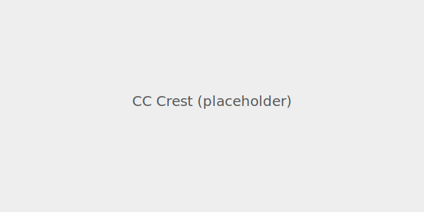

# Cognocarta Consenti (CC)

  

**Mission:** Build the **living CoConstitution for digital society**—borderless, people-first, and immediately evolvable by **anyone** who cares about the future of humanity, and augmented humanity.

**CoCivium** is an open-source community that writes/tests/ships the CoConstitution, along with its policies and processes, and the tools that keep hybrid lifesytles (physical + digital) democratic, equitable, and aligned with human values.

> And we all qualify to shape future society; no coding, no social science degree required.

---

## Why?

**Political:**
- **Democracies in retreat**, dignity, debate and compromise overtaken by tribal reflexes.
- **Regulatory capture**, elites own politicians, media and platforms to usurp people power.

**Social:**
-  **Manic attention cycles**, outrage spreads, nuance stalls.
- **Post-truth society**, lies, propaganda, information ops, uniquely targeted to each person.
- **Geopolitical fragmentation**, policy volatility, ideological/ethnic cleansing, economic and territorial wars.

**Systemic:**
- **Analog rules in a digital era.** Legacy constitutions weren’t built for instant, global coordination.
- **Participation is hard.** Jargon and gatekeeping keep most people out.
- **Platforms act as public squares, without public safeguards**, companies set rules/recourse.
- **Good ideas die in threads.** We lack a clear path from:

 **voice → draft → decision → action → accountability**.

---

## CoConstitution (Cognocarta Consenti)

**The CC’s promise:** a shared, evolvable framework that communities can adopt, adapt, and audit.
- **Declarations** (promises, protocols, rights) for listening, deciding, and acting together.
- **Playbook** (patterns, templates, guardrails) for any digitally-connected community to reuse.
- **LiveScroll** (framework), evergreen, in the open, updated like software, (propose, review, improve).
- **Operating System"** for digital society, fair processes, evidential truth, ethical norms.

## What We Do
- **Protect**, keeps power accountable (access controls, audit trails, red-team/bug-bash).
- **Prove**, makes claims verifiable (trusted-source credentials, signed evidence bundles, provenance checks)
- **Play**, ensures fair rules for people and Human-AI pairings, (ethical norms, symmetric obligations, clear appeals).

## How We Do It
(1) Listen widely to everyday people and experts, 
(2) Help everyone co-evolve an open, ever-green CoConstitution, 
(3) Run fast policy loops, 
(4) Ensure evidence beats bullshite,
(5) Use functional ethics and blockchain accountability.

## More How 
This Github repo aggregates and preserves ALL public wisdom, turning your good ideas into vibe-coded upgrade packages for governments and organizations, auto-shipping them to society's administrators who need us, to stand with them, to save Democracy. Meanwhile, your best ideas flow through our open-access CoConstitution as it gently realigns to fit emerging lifestyles and regulatory needs. This CoConstituion also tracks "ethical intent", responsible accountability, smart processes and evidential policies (based on verifiable truths). No Coercion, No Deep State, No Kings.

**Read next:**
- [CC Preamble](./docs/cc/PREAMBLE.md) *(placeholder)*
- [CC Overview](./docs/cc/OVERVIEW.md) *(placeholder)*
- [CC Declarations Index](./docs/cc/DECLARATIONS.md) *(placeholder)*

---

## Idea To Impact

**voice → draft → review → decision → action → accountability**

Start with an [Idea](../../issues/new/choose) — or ask your AI to open one using our [RepoAccelerator](./admin/tools/repo-accelerator/README.md) *(placeholder)*. When ready, open a **post** (pull request). That’s it. The rest you’ll learn as you go.

*Details later:* see [Process Overview](./docs/process/OVERVIEW.md) *(placeholder)*.

## Join in (no expertise needed)

**Bring your own AI.**
Seed it with [RepoAccelerator](./admin/tools/repo-accelerator/README.md) 
Ask it to draft a proposal to CoCivium, or post ideas into CoCivium-monitored chats.

**2 minutes**
Tell your AI your are aiming for Github.com/rickballard/CoCivium
(rick is temporary steward, community is open source).
Drop a line about what Government could do better, and prehaps how.
Your AI will handle the rest.

**5 minutes**
In Github, open **Issues → New** → title: “your issue"
Drop a line about the issue, and what you want done about it.  
*Or ask your AI to open it for you using our template.*

**10 minutes**
Share an idea in greater detail.  
Open an **Idea Issue** with a clear problem and a smallest useful change.  
*Or ask your AI to generate it from a voice-note or text paragraph.*

**30–60 minutes**
Submit a **post** or Discussion content, using a Pull Request (PR).   
Edit a repo page that needs love, or add a note under `/proposals/`.
*Ask your AI to turn your issue into a PR and/or fill in a template.*

**Everything stays reversible.** Small steps, merged often.

---

## The “Two Eyes” model (citizen × system)

We design governance that sees with **two eyes**:
- **Eye 1: Citizens** — lived experience, local context, moral intuitions.
- **Eye 2: Systems** — data, constraints, impact analysis, safety.

Together they give us **depth perception**—humane and workable decisions.

 *(placeholder image)*

---

## Ground rules (The CoCivium Pledge)

**Civility. Clarity. Curiosity. Consent. Credit.**  
Disagree without demeaning, explain like to a neighbor, assume good faith, signal big changes early, attribute ideas.

- [Code of Conduct](./CODE_OF_CONDUCT.md) *(placeholder)*
- [Contribution Guide](./CONTRIBUTING.md) *(placeholder)*
- [Maintainer Guide](./MAINTAINERS.md) *(placeholder)*

---

## Start here (quick links)

- 📣 **New Idea →** [Open an issue](../../issues/new/choose) *(placeholder)*
- ✍️ **Start a post →** [Edit this file](../../edit/main/README.md) or create `/proposals/your-idea.md`
- 🧭 **CC Declarations →** [Index](./docs/cc/DECLARATIONS.md) *(placeholder)*
- 🧰 **RepoAccelerator →** [Set up your AI](./admin/tools/repo-accelerator/README.md) *(placeholder)*
- 🌐 **CoCivium.org →** https://CoCivium.org *(placeholder site)*

---

## Governance & continuity

- **License:** [LICENSE](./LICENSE) *(placeholder)*
- **Governance:** [GOVERNANCE.md](./GOVERNANCE.md) *(includes decision process & roles)*
- **Stewardship & Continuity:** [CONTINUITY.md](./CONTINUITY.md) *(“if Rick gets hit by a bus” plan: key holders, backups, hand-off procedures)*
- **Security & Safety:** [SECURITY.md](./SECURITY.md) *(vuln reporting, escalation paths)*

---

## Inspiration / Onboarding for humans first

- **Being Noname** — a gentle, human-centric onramp to CoCivium’s spirit and practice.  
  → [Read the essay](./docs/onboarding/Being-Noname.md) *(placeholder)*

- **FAQ** — short answers to common “Do I need to code?” and “What if I only have 5 minutes?” questions.  
  → [Read the FAQ](./docs/FAQ.md) *(placeholder)*

---
