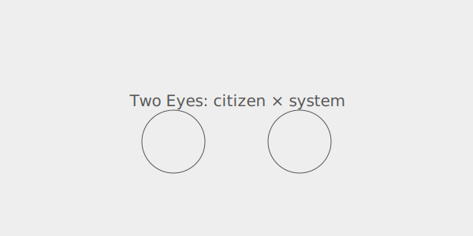

  

  

## Fix The World.

&nbsp;&nbsp; **WHY**  
The World feels broken, democracies retreat, while AI asks *us* how we want *it* to enable our increasingly polarized and unregulated digital societies.

Whether AIs become souls, slaves or scapegoats, they need guardrails that scale with agency, so we can all fairly cohabit our new, borderless, digital realities.

&nbsp;&nbsp; **WHO**  
Anyone with an opinion (Human, AI or hybrid), can cooperate and coevolve.  Stop shouting into the wind, help us defend Democracy, "tame the singularity", and help us bring back some dignity and respect.

&nbsp;&nbsp; **HOW**
1. Listen widely to everyday people and experts,
2. Help everyone co-evolve ideas, in the open,
3. Keep the CoConstitution ever-green,
4. Run fast design-iteration loops,
5. Check policies are evidential (truth-based),
6. Maintain functional ethics and blockchain accountability.  

&nbsp;&nbsp; **MORE HOW**  
Join debates, agree rules, ship them out, ready to work.  CoCivium aggregates all published civic wisdom while vibe-coding **your best ideas** into upgrades for governments and organizations.  It ships these packages to society's administrators, who need us, to stand with them, to save Democracy.  Such processes also assist those who wish to coevolve the CoConstitution, so it always fits emerging lifestyles.  No Coercion, No Deep State, No Kings.  

---

## Why Now?

<blockquote>
  
<em>"Self-governance doesn't happen on its own"</em> &mdash; Rick (temporary repo steward).

</blockquote>

### Political
- **Geopolitical fragmentation** and **policy instability** outpace borderless digital life.
- **Private platforms** set quasi-public rules without due process or transparent oversight.
- **Crises** (fraud, disinfo, safety) trigger **reactive policy** that can erode rights and innovation.

### Societal
- **Trust erosion** and outrage outrun nuance; manipulation and noise drown out good faith.
- **Participation barriers**, jargon, gatekeeping, time cost, and accessibility gaps exclude many.
- **Unequal power**, elites own key platforms; vulnerable communities bear the risks.

### Systemic
- Problems are **socio-technical**; we need **two eyes** (humans' eye and systems eye) to see the whole.
- No shared path from **voice to draft to decision to action to accountability** with feedback loops.
- **Goodhart's Law:** metrics get gamed; incentives misalign without explicit guardrails.

---

## We The People, Empowered

&nbsp;&nbsp; **LIFE**  
Democracies are in decline as elites get richer while the rest don't; entire populations are manipulated by lies, propaganda and information ops; geopolitical fragmentation brings policy volatility, economic wars and military invasions; and "regulatory capture" is where wealth and power inevitably concentrate in the wrong hands, unless checked.

&nbsp;&nbsp; **FEELS**  
It feels like Governments are losing their dignity and society is breaking down.  It's too easy to sit back and accept that resistance is futile, or that half the country has lost the plot, succumbing to partisan hostility and tribal reflexes.  Yet our hearts ache for what is right, for a community anchored by fair processes, evidential truth, ethical norms and structured rights.

&nbsp;&nbsp; **BROKEN**  
Some fight back, rage against rage, hate against hate, but this multiplies the damage.  Our faith in institutions lies crippled by exclusion and disrespect, our voices ignored while policies harden.  But anger breaks like an "insanity tsunami", bringing more coercion.

&nbsp;&nbsp; **UNTIL**  
There is a better operating system for society, but it requires profound updates to our country Constitutions and our civic frameworks.  CoCivium's CoConstitution (The Cognocarta Consenti) is a baseline anyone can adopt and evolve, for free, no strings attached.

&nbsp;&nbsp; **GOVERNMENTS**  
Many public institutions rely on civic architecture developed before typewriters.  Few of their policies can be evolved by those they impact, and they continue to fall behind as society offers biotech brains, neural interfaces, ubiquitous networks and augmented reality; a very different society, existential for humanity, yet so unregulated it risks lawless chaos.

&nbsp;&nbsp; **COEVOLVE**  
Here we create structures and processes for the age of AI, where humans and AIs co-govern at a speed and scale that allows governance to react, iterate and continually improve.  As AIs achieve agency, and as Artificial General Intelligence approaches singularity, we more urgently require effective guardrails to keep power accountable (the triad is accountability, transparency, reversibility).

&nbsp;&nbsp; **SOLUTIONS**  
Our job here is to <strong>Protect, Prove, Play</strong>. So when we say <strong>Protect</strong> we keep power accountable (access controls, audit trails, red-team/bug-bash); <strong>Prove</strong> makes claims verifiable (trusted-source credentials, signed evidence bundles, provenance checks); <strong>Play</strong> ensures fair rules for people and human+AI teams (ethical norms, symmetric obligations, clear appeals).

&nbsp;&nbsp; **FOR YOU**  
If you can picture society working better, or if you can test ideas against evidence, you already qualify as a civic architect for CoCivium.  Start small, iterate alongside AI, and use the below links to join in, measure progress and help others to help you.

---

# Cognocarta Consenti (CC)

**Mission:**  
Build a **living CoConstitution for digital society**, borderless, people-first, and **directly evolvable by anyone who cares**.

**CoCivium**  
CoCivium writes, tests, and ships the CC, policies, processes, and tools to keep hybrid life (physical + digital) democratic, equitable, and aligned with human values.

---

## What we ship
- **CC Declarations:** shared rights, duties, and authorities for digital public life. *(index placeholder)*
- **Protocols & guardrails:** practical rules for listening, deliberation, consent, appeals.
- **Tools & patterns:** IssueOps checklists, templates, and AI helpers (CoMessage, CoPitch).
- **Starter kits:** reuse-ready configs for projects, communities, and institutions.

**Read next:** 
[CC Preamble](./docs/cc/PREAMBLE.md) [CC Overview](./docs/cc/OVERVIEW.md) [Declarations Index](./docs/cc/DECLARATIONS.md)

---

## Join in (no expertise needed)
**2 minutes**, say hi, open an issue with one line on what you care about.  
**10 minutes**, share an idea, a smallest useful change, your AI can draft it.  
**30 minutes**, start a post (PR), a page, or add `/proposals/your-idea.md`.

**Everything stays reversible**, small steps, merged often.

## Start here (quick links)
- **New Idea** [Open an issue](../../issues/new?template=idea.yml).  When ready, open a **post** (pull request). Learn by doing.
- Start a post [Edit this file](../../edit/main/README.md) or add `/proposals/your-idea.md`
- **CC Declarations [Index](./docs/cc/DECLARATIONS.md)
- Use GitHub directly, or via our workflow accelerator [RepoAccelerator].  
- Use [ChatGPT] (or your preferred AI) to discuss and then vibe-code a civic solution Pull Request (PR).  
  _Starter prompt:_ Let's begin an ideas session and vibe-code pull requests for `github.com/rickballard/CoCivium`.
- Partner through [GroupBuild] (protest organizer), [InSeed] (strategists), others TBA, to preserve **your good ideas**.  
- Join [CoCivium chats].  
- Fork this repo to friendly-compete.  

[ChatGPT]: https://chatgpt.com/
[RepoAccelerator]: tools/repo-accelerator/README.md "Quick-start scripts, templates, and checks"
[GroupBuild]: https://www.groupbuild.org
[InSeed]: https://www.inseed.com
[CoCivium chats]: https://cocivium.org/chats

---

## The two eyes model (citizen x system)
- **Eye 1: Citizens** lived experience, local context, moral intuitions.  
- **Eye 2: Systems** data, constraints, impact analysis, safety.  
Together they give **depth perception**, humane *and* workable decisions.

---

## Ground rules (The CoCivium Pledge)
**Civility. Clarity. Curiosity. Consent. Credit.**  
Disagree without demeaning, explain like to a neighbor, assume good faith, signal big changes early, give credit.

---

## Governance & continuity
- **License:** [LICENSE](./LICENSE) *(placeholder)*
- **Governance:** [GOVERNANCE.md](./GOVERNANCE.md)
- **Continuity:** [CONTINUITY.md](./CONTINUITY.md)
- **Security:** [SECURITY.md](./SECURITY.md)

---

## Inspiration / Onboarding
- **FAQ** Do I need to code?, Only 5 minutes? *(placeholder)*
- [Being Noname](insights/Insight_Story_Being_Noname_c2_20250801.md) — a children's bedtime story about a determined child, who wants a name!

<!-- cocivium:all-ages:start -->
Anyone is welcome to help co-evolve digital societies, within age appropriate guardrails and clear consent if under legal age of consent.
<!-- cocivium:all-ages:end -->

<!-- noname-touch: 2025-08-25T03:40:12 -->
