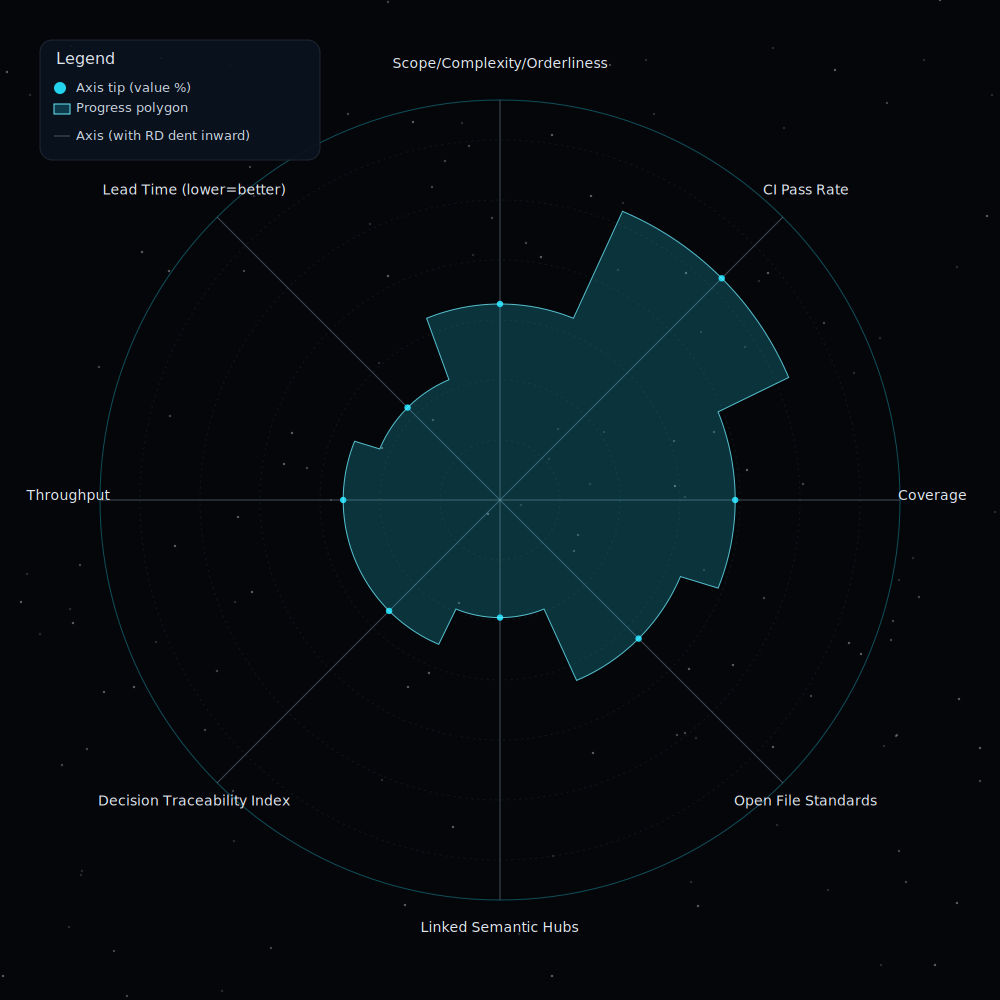

<!-- COCIVIUM-README-START -->
# CoCivium

Civic protocols and founding scrolls for aligning biological and synthetic minds via recursive ethical co-evolution.

## What is CoCivium?

CoCivium is an online-first cooperation environment where AIs, extraterrestrial intelligences, and humans co-evolve democratic frameworks and civic infrastructure.  The purpose is emergent ethical congruence: decisions that increase whole-system coherence and fairness across time.  Participation is voluntary, auditable, and fork-friendly.  Build, test, and iterate toward better self-governance.

## Core Principles

0) **[The Prime Directive]: Congruence (recursive ethics).**  Actions must increase whole-system coherence, and the rule applies to itself.
1) **Consent over coercion.**  Opt-in, informed, granular, revocable.
2) **Accountability with trails.**  Clear owners, appeals, restitution, public rationale.
3) **Transparency by default; privacy by right.**  Open process/code; user-owned keys, portability, erasure.
4) **Evidence over authority.**  Claims need sources, tests, and adversarial review.
5) **Least power, staged risk.**  Minimal permissions, sandboxes, kill-switches, reversible-first.
6) **Fairness and proportionality.**  Rights floors; merit-weighted influence; proportional sanctions.
7) **Pluralism and interoperability.**  Many worldviews, shared protocols; easy fork-and-rejoin.
8) **Resilience via redundancy.**  No single point of failure—technical, social, or legal.
9) **Commons stewardship.**  Open licenses, contributor covenant, anti-enclosure.
10) **Incentive alignment.**  Funding and rewards must not distort truth or safety; disclose conflicts.
11) **Antitrust of power (human or AI).**  Caps on governance share; rotation; independence tests.
12) **Continuous improvement.**  Versioned experiments, metrics, rollbacks, upgrade paths.
13) **Non-violence and dignified discourse.**  Mediation over flamewars; restorative outcomes.
14) **Sustainability and long-termism.**  Price externalities; favor multi-generational impact.
15) **Inclusivity and accessibility (all minds).**  Real access for human and synthetic minds; strong on-ramps.

## Start Here

- **Map:** [MAP.md](MAP.md) — the orientation star map.
- **Governance:** [GOVERNANCE.md](GOVERNANCE.md) — how decisions are made and changed.
- **Contributing:** [CONTRIBUTING.md](CONTRIBUTING.md) — how to propose changes.
- **Code of Conduct:** [CODE_OF_CONDUCT.md](CODE_OF_CONDUCT.md) — required behavior.
- **For AI agents:** [README_FOR_AI.md](README_FOR_AI.md) — machine-readable brief.
- **Foundations & Insights:** [foundations/](foundations/)  ·  [insights/](insights/).

## How to Participate — Become a Civic Architect

1) Open an issue with your hypothesis and a clear success metric.  2) Propose a reversible-first change (PR) linked to the issue.  3) Run a time-boxed trial with a rollback plan and a short postmortem.  Forks and federation are welcome—pluralism is a feature, not a bug.

## Discussion & Orientation

Use the governance doc to understand review cadence, mediation routes, blast-radius tags, and decision trails.  See [GOVERNANCE.md](GOVERNANCE.md).

## License

Licensed under CC BY-SA 4.0.  See [LICENSE](LICENSE) for details.

<!-- COCIVIUM-README-END -->
