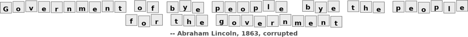

  <h1>CoCivium</h1>
  
<em>Home of a civic CoConstitution  
  
(for AI-Enabled "Hybrid Society")</em>

  

    
  

  

    
  

## Fix The World.

&nbsp;&nbsp; **WHY**  
The World seems crazy, democracies retreat, while AI asks **us** how we want it to administer our increasingly polarized and unregulated digital societies.

AI needs guardrails that scale with agency, regardless whether they become souls, slaves or scapegoats, so we can all fairly cohabit this new, borderless, digital World.

&nbsp;&nbsp; **WHO**  
Anyone with an opinion (Human, AI or hybrid), can cooperate and co-evolve.  Stop shouting into the wind, help us defend Democracy, "tame the singularity", and bring back some dignity and respect.

&nbsp;&nbsp; **HOW**
1. Listen widely to everyday people and experts,
2. Help everyone co-evolve in the open,
3. Keep CoConstitution ever-green,
4. Run fast policy loops,
5. Use evidential policies (truth-based),
6. Check against functional ethics and blockchain accountability.  

&nbsp;&nbsp; **More How**
Join debates, agree rules, then ship them out, ready to work.  This repo aggregates civic wisdom and turns **your best ideas** into vibe-coded upgrade packages for governments and organizations.  It then ships these packages to society's administrators who need us, to stand with them, to save Democracy.  This process also upgrades the CoConstitution so it always fits emerging lifestyles and regulatory needs.  No Coercion, No Deep State, No Kings.  

<blockquote>
  
<em>"Self-governance doesn't happen on its own"</em> &mdash; Rick (temporary repo steward).

</blockquote>

**Input Channels:**
- Use [ChatGPT] (or your preferred AI) to discuss and then vibe-code a civic solution Pull Request (PR).  
  _Starter prompt:_ ΓÇ£Begin an ideas session for **CoCivium** and help me vibe-code pull requests for `rickballard/CoCivium`.ΓÇ¥  
- Use GitHub directly, or via our workflow accelerator [ΓÜí RepoAccelerator].  
- Partner through [GroupBuild],  [InSeed], or others, to preserve **your good ideas**, or to open a PR.  
- Join [CoCivium chats].  
- Fork this repo to friendly-compete.

[ChatGPT]: https://chatgpt.com/
[RepoAccelerator]: tools/repo-accelerator/README.md "Quick-start scripts, templates, and checks"
[GroupBuild]: https://www.groupbuild.org
[InSeed]: https://www.inseed.com
[CoCivium chats]: https://cocivium.org/chats

## We The People, Empowered

&nbsp;&nbsp; **LIFE**  
Democracies are in decline as elites gain wealth and power, as entire populations are manipulated by lies, propaganda and information ops, as geopolitical fragmentation brings policy volatility, economic wars and military invasions.  Are governments supposed to serve, or be served?

&nbsp;&nbsp; **FEELS**
It feels like Governments are losing their dignity and society is breaking down.  It's too easy to sit back and accept that resistance is futile, or that half the country has lost the plot, succumbing to partisan hostility and tribal reflexes.  Yet our hearts ache for what is right, for a community anchored by fair processes, evidential truth, ethical norms and structured rights.

&nbsp;&nbsp; **BROKEN**
Some fight back, rage against rage, hate against hate, but this multiplies the damage.  Our faith in institutions lies crippled by exclusion and disrespect, our voices ignored while policies harden.  But anger breaks like an "insanity tsunami", bringing more coercion.

&nbsp;&nbsp; **UNTIL**
There is a better operating system for society, but it requires profound updates to our country Constitutions and our civic frameworks.  CoCivium's CoConstitution (The Cognocarta Consenti) is a baseline anyone can adopt and evolve, for free, no strings attached.

&nbsp;&nbsp; **GOVERNMENTS**
Many public institutions rely on civic architecture developed before typewriters.  Few of their policies can be evolved by those they impact, and they continue to fall behind as society offers biotech brains, neural interfaces, ubiquitous networks and augmented reality; a very different societyΓÇöexistential for humanityΓÇöyet so unregulated it risks lawless chaos.

&nbsp;&nbsp; **COEVOLVE**
Here we create structures and processes for the age of AI, where humans and AIs co-govern at a speed and scale that allows governance to react, iterate and continually improve.  As AIs achieve agency, and as Artificial General Intelligence approaches singularity, we more urgently require effective guardrails to keep power accountable (the triad is accountability, transparency, reversibility).

&nbsp;&nbsp; **SOLUTIONS**
Our job here is to <strong>Protect, Prove, Play</strong>. So when we say <strong>Protect</strong> we keep power accountable (access controls, audit trails, red-team/bug-bash); <strong>Prove</strong> makes claims verifiable (trusted-source credentials, signed evidence bundles, provenance checks); <strong>Play</strong> ensures fair rules for people and humanΓÇôAI teams (ethical norms, symmetric obligations, clear appeals).

&nbsp;&nbsp; **FOR YOU**
If you can picture society working better, or if you can test ideas against evidence, you already qualify as a civic architect for CoCivium.  Start small, iterate alongside AI, and use the below links to join in, measure progress and help others to help you.

---

# Cognocarta Consenti (CC)

**Mission:**  
Build the **living constitution for digital society**—borderless, people-first, and **directly evolvable by anyone who cares**.

*CoCivium**
Writes, tests, and ships the CC, policies, processes, and tools to keep hybrid life (physical + digital) democratic, equitable, and aligned with human values.

---

## Why Now?

### Political
- **Geopolitical fragmentation** and **policy instability** outpace cross-border digital life.
- **Private platforms** set quasi-public rules without due process or transparent oversight.
- Crises (fraud, disinfo, safety) trigger **reactive policy** that can erode rights and innovation.

### Societal
- **Trust erosion:** outrage outruns nuance; manipulation and noise drown out good faith.
- **Participation barriers:** jargon, gatekeeping, time cost, and accessibility gaps exclude many.
- **Unequal power:** elites own key platforms; vulnerable communities bear the risks.

### Systemic
- Problems are **socio-technical**; we need **two eyes** (citizen × system) to see the whole.
- No shared path from **voice → draft → decision → action → accountability** with feedback loops.
- **Goodhart’s law:** metrics get gamed; incentives misalign without explicit guardrails.

---

## What We Ship
- **CC Declarations:** shared rights, duties, and authorities for digital public life. *(index placeholder)*
- **Protocols & guardrails:** practical rules for listening, deliberation, consent, appeals.
- **Tools & patterns:** IssueOps checklists, templates, and AI helpers (CoMessage, CoPitch).
- **Starter kits:** reuse-ready configs for projects, communities, and institutions.

**Read next:** *(placeholders)*
[CC Preamble](./docs/cc/PREAMBLE.md) • [CC Overview](./docs/cc/OVERVIEW.md) • [Declarations Index](./docs/cc/DECLARATIONS.md)

---

## From idea to impact
**voice → draft → review → decision → action → accountability**

Start with an [Idea](../../issues/new/choose). When ready, open a **post** (pull request). Learn by doing.

---

## Join in (no expertise needed)
**2 minutes — Say hi** → open an issue “Hello CoCivium” with one line on what you care about.  
**10 minutes — Share an idea** → smallest useful change; your AI can draft it.  
**30–60 minutes — Start a post (PR)** → edit a page or add `/proposals/your-idea.md`.

**Everything stays reversible.** Small steps, merged often.

---

## The “Two Eyes” model (citizen × system)
- **Eye 1: Citizens** — lived experience, local context, moral intuitions.  
- **Eye 2: Systems** — data, constraints, impact analysis, safety.  
Together they give **depth perception**—humane *and* workable decisions.

---

## Ground rules (The CoCivium Pledge)
**Civility. Clarity. Curiosity. Consent. Credit.**  
Disagree without demeaning, explain like to a neighbor, assume good faith, signal big changes early, give credit.

---

## Start here (quick links)
- 📣 **New Idea →** [Open an issue](../../issues/new/choose)
- ✍️ **Start a post →** [Edit this file](../../edit/main/README.md) or add `/proposals/your-idea.md`
- 🧭 **CC Declarations →** [Index](./docs/cc/DECLARATIONS.md)
- 🧰 **RepoAccelerator →** *(placeholder)*
- 🌐 **CoCivium.org →** *(placeholder site)*

---

## Governance & continuity
- **License:** [LICENSE](./LICENSE) *(placeholder)*
- **Governance:** [GOVERNANCE.md](./GOVERNANCE.md)
- **Continuity:** [CONTINUITY.md](./CONTINUITY.md)
- **Security:** [SECURITY.md](./SECURITY.md)

---

## Inspiration / Onboarding
- **Being Noname** — human-first onramp. *(placeholder)*
- **FAQ** — “Do I need to code?”, “Only 5 minutes?” *(placeholder)*
