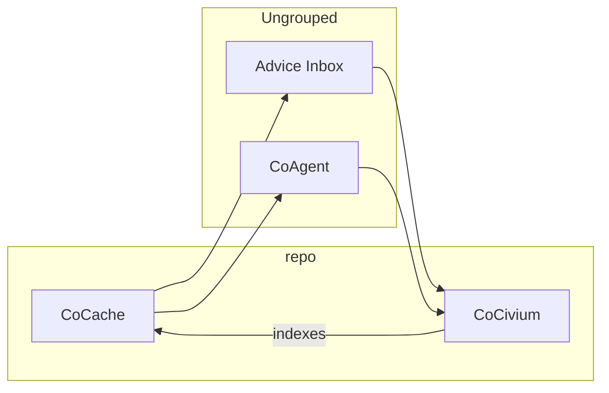

# CoCivium Diagrams

This page is generated from JSON files under `docs/diagrams/examples/`.
**Do not hand-edit the fenced blocks below.** Update JSON and re-run the builder.

## Asset Graph (Mermaid, generated)


## D2 (placeholder, reserved)
```d2
// d2 placeholder; kept to satisfy fence invariants.
```
