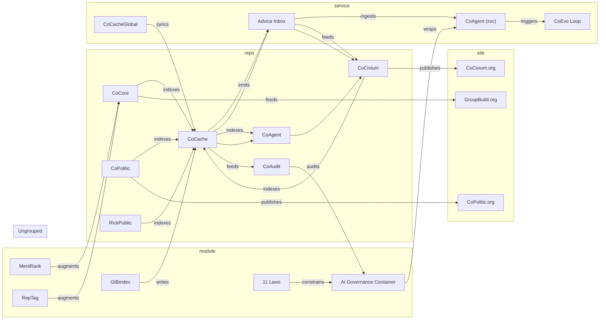

> **Live gallery:** [Open the live gallery](./diagrams/index.html) — full-width, flicker-free.
## Gallery

Browse: **[Diagram Inventory](diagrams/INVENTORY.md)** for thumbnails, SVG/PNG links, and quick "Discuss" buttons.


**See also:** [Diagram Inventory](diagrams/INVENTORY.md)
[](https://github.com/rickballard/CoCivium/actions/workflows/diagrams-export.yml)

# CoCivium Diagrams

This page is generated from JSON files under `docs/diagrams/examples/`.
**Do not hand-edit the fenced blocks below.** Update JSON and re-run the builder.

## Asset Graph (Mermaid, generated)


> **Caption:** CoSuite asset relationships (best-effort; see JSON in `docs/diagrams/examples/`).

## D2 (placeholder, reserved)
```d2
// placeholder kept to satisfy fence invariants.
```


---
**Legend:** see [docs/diagrams/render/legend.mmd](diagrams/render/legend.mmd)


## Exported (SVG/PNG) quick view

<!-- picture:asset-graph -->
<picture>
  <source type="image/svg+xml" srcset="/rickballard/CoCivium/raw/main/docs/diagrams/render/asset-graph.svg">
  
</picture>
