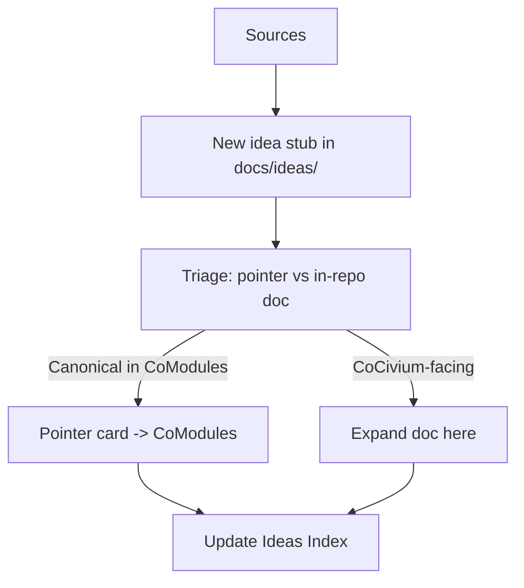

<!-- status: stub; target: 150+ words -->

## PR Flow
```mermaid
flowchart TD
  A[Start Here] --> B[RepoAccelerator: local setup]
  B --> C[Create topic branch]
  C --> D[Commit (LF-only); pre-commit passes]
  D --> E[Open PR]
  E --> F[Review & checks]
  F --> G[Squash & merge]
```

## Ideas Flow



