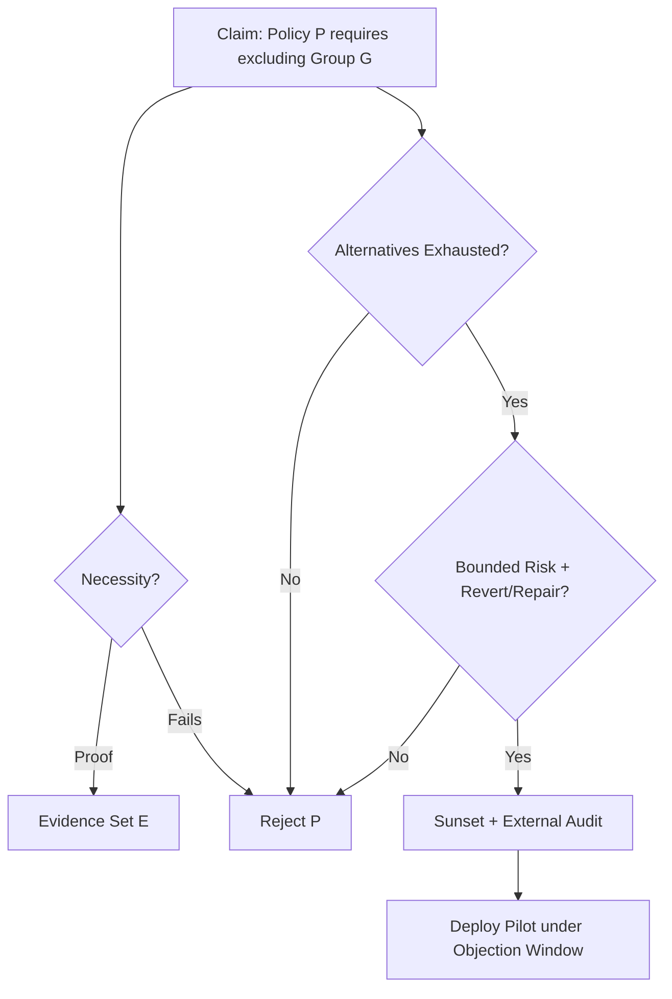

# Argument Map  -  Disharmony Burden (Template)

```mermaid
graph TD
  C1[Claim: Policy P requires excluding Group G] --> A1{Necessity?}
  A1 -->|Proof| E1[Evidence Set E]
  A1 -->|Fails| R1[Reject P]
  C1 --> A2{Alternatives Exhausted?}
  A2 -->|Yes| A3{Bounded Risk + Revert/Repair?}
  A2 -->|No| R1
  A3 -->|Yes| S1[Sunset + External Audit]
  A3 -->|No| R1
  S1 --> D1[Deploy Pilot under Objection Window]
```

