# CoCivium™

**CoCivium™: an open-source civic architecture for hybrid human + AI governance and co-evolution.**

We deliver frameworks, policies, standards, and tools that help communities govern fairly, transparently, and adaptively.
This is the **front door**: start here if you want to **engage, contribute, or explore outputs**.

## Quick Navigation
- [Onramps](onramps/)  -  Choose your path into CoCivium™
- [Outputs](outputs/index.md)  -  The deliverables CoCivium™ produces
- [Academy](academy/genesis.md)  -  Philosophy & genesis
- [Progress](#stage-map)  -  Where CoCivium™ is in its evolution
- [Community](#community)  -  Connect & contribute

## Process Flow
```mermaid
flowchart TD
  A[Engagee / Contributor] --> B[Workflows (CoCleanse • CoWrap • Reviews • Metrics)]
  B --> C[Policies]
  B --> D[Standards & Specs]
  B --> E[Artefacts & Tools]
  B --> F[Records & Reports]
```

## Stage Map

```mermaid
timeline
  title CoCivium Evolution
  2025 : Seed : Charter • Repo Genesis • First Tools
  2027 : Growth : Modules • Metrics • Pilot Communities
  2032 : Maturity : Global Adoption • Scaling Governance
  2050 : Hybrid : Human+AI Civic Systems
  21xx : Beyond : Extraterrestrial Integration
```


## Why Engage?
- Shape policies that could govern the AI–human epoch
- Learn civic frameworks to strengthen your community now
- Gain recognition via contribution & badges
- Co-evolve at the frontier of governance

## Choose Your Path
- [Explorer](onramps/explorer.md)
- [Contributor](onramps/contributor.md)
- [Civic Architect](onramps/civic_architect.md)
- [Researcher / Partner](onramps/researcher.md)

## Community
- Discussions: (placeholder)
- Outreach: (placeholder)
- Progress logs: `/docs/progress/` (placeholder)

> 🚧 **Proposal draft**  -  for review. Do not merge until HumanGate approval.


