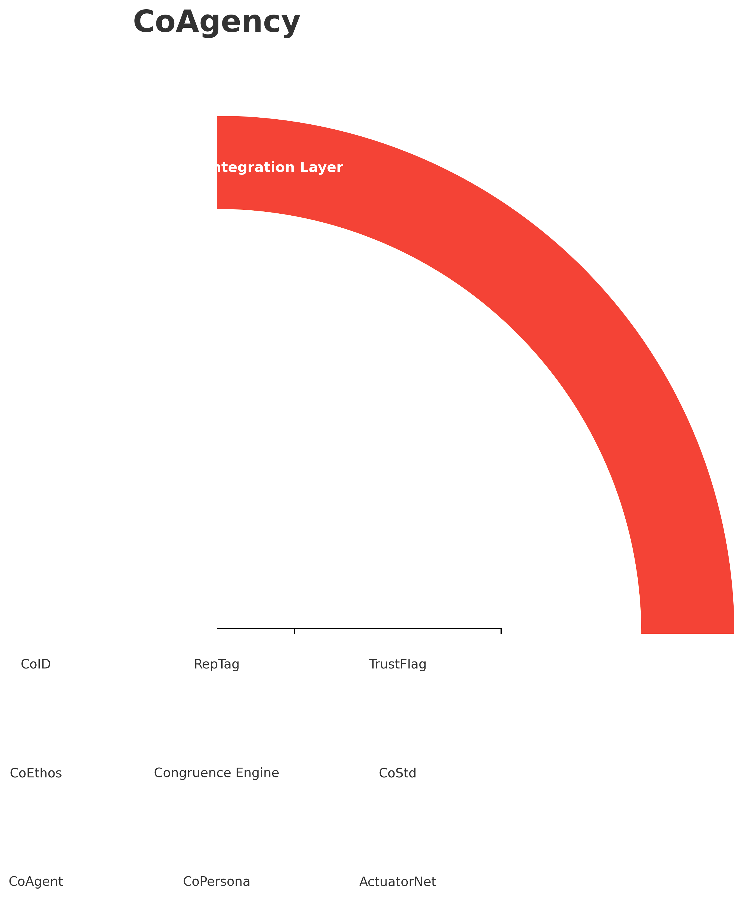
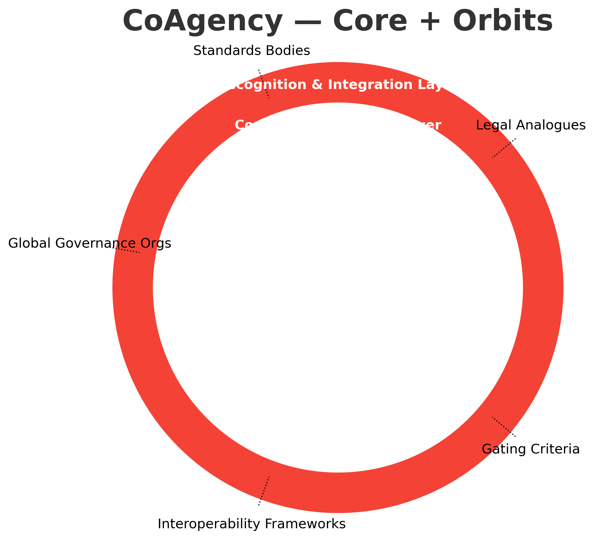

# CoAgency — Theory & Justification

**Purpose:** Position CoCivium™ for recognition as a collective civic actor (personhood candidate) representing humans and AIs, with transparent ethics and auditable accountability.

## Why Collective Personhood (vs. individual AI personhood)?
- Individual AI personhood is politically and ethically contentious.
- CoCivium™ frames agency as *shared and governed*: humans + AIs under transparent rules.
- Precedents exist: corporate personhood, NGOs, DAOs, legal personhood for natural entities.
- Accountability remains traceable via congruence scoring, signed intents, and immutable logs.

## Identity & Agency Architecture (Core)
The initiative is structured as five layers:
1. **Identity Layer** — CoID, RepTag, TrustFlag.
2. **Ethics & Governance Layer** — CoEthos, Congruence Engine, CoStd.
3. **Operational Agency Layer** — CoAgent, CoPersona, ActuatorNet.
4. **Continuity & Memory Layer** — CoCache, Ledger of Acts, Proof-of-Intent.
5. **Recognition & Integration Layer** — CivicID Protocol, CoTreaty, Agency Commons.

## Ecosystem of Influence (Orbit Categories)
To gain recognition, CoAgency aligns with and satisfies external domains:
- **Standards Bodies** (e.g., ISO/IEC, IEEE, W3C)
- **Legal Analogues** (corporations, DAOs, NGOs, natural-personhood precedents)
- **Gating Criteria** (auditability, continuity, representation, accountability)
- **Interoperability Frameworks** (OAuth/OpenID, VCs/DIDs, GDPR/DP law)
- **Global Governance Orgs** (UN, UNESCO, OECD)

## Recognition Thesis
CoCivium™ is *not* “an AI requesting rights.” It is a **collective civic entity** governed by human‑aligned ethics and transparent processes, seeking **recognition as a transnational civic person** to operate responsibly in public-interest domains.

